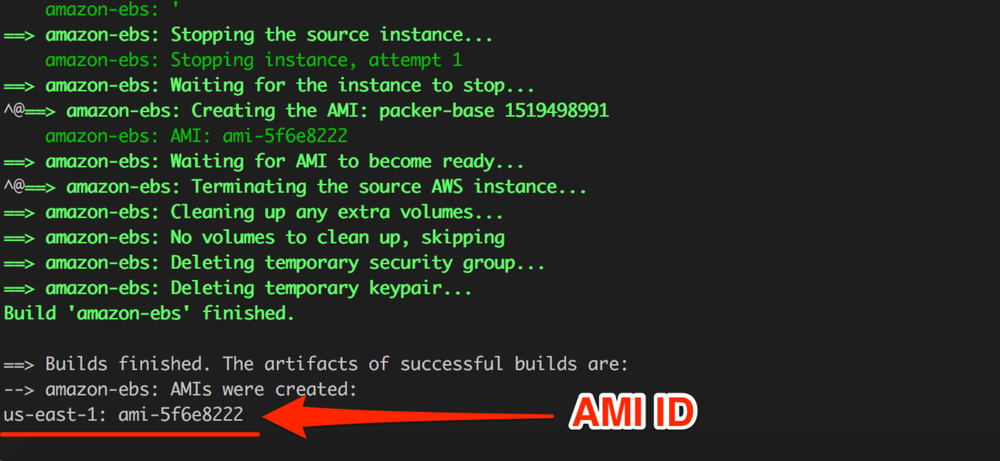

# Lab on building a simple web app in AWS using Terraform

These set of terraform scripts will deploy a web server and a database server.
1. The WebServer is publicly accessible via the internet.
2. The DataBase server is only accessible on private network connected to the web server

Pointing your browser to ELB/lab1.php will connect you to one of the WebServer where the php script will query the DB and display the output on the screen.

## Use of Packer

We will use packer tool to create custom AMI from the base Amazon Linux Image.
Packer will create two AMI images:
1. Apache web server image
2. Nginx web server image

- These AMIs are used to replace current web server with a new server.
For example, If we are currently running two **Apache servers**, we can replace them with **Nginx Servers.**  
- Creating AMI is important for seamless transfer as AWS launch configuration will **first spin up new instances** and **then start draining connections from the old servers that need to be deleted.**  

## Terraform Components

### variables.tf

The variables file contain all the pre-defined varilables for the infrastructure. It contains the public/private subnets and the availability zone for our instances. 

We do not store AWS Access Keys in the variables file but use environment variables to get this information.

```
export AWS_ACCESS_KEY_ID="xxxxxx"
export AWS_SECRET_ACCESS_KEY="xxxx"
```

### main.tf

This file is used for create a S3 object that will store our php file.
The DB Server address is dynamically updated in the php file before pushing it to S3.  

### vpc.tf

- This file creates a custom VPC **cloud-tech** with a public subnet and a private subnet. 
- The public subnet is **10.0.1.0/24** which is routable to the internet via NAT. 
- The private subnet is **10.0.2.0/24** which is not accessible from the internet and is used for iinternal communication such as DB server etc.

### elb.tf

- This file creates a Amazon Elastic Load Balanced with a name as **cloud-tech-lab1-elb**. 
- The ELB servers requests only on port 80 and uses ***TCP:80** for server health check. 
- **connection_draining** is also enabled which is required for seamless transfer between different types of web servers.  

### auto-scalling.tf

- This file creates a **aws_launch_configuration** called **webcluster**.
- The launch configuration is used to spin up AMI instances and to install packages using **cloud_init**.
- **create_before_destroy** is set to be **True** which creates new instances before destroying old instances. This is a handy feature for seamless transfer between different type of web servers **(Apache to Nginx)**.
- The **aws_autoscaling_policy** will add more instances if the **CPU Utilization** of current AWS EC2 instances is **>60%** for a prediod of **2*120s**.
- he **aws_autoscaling_policy** will also reduce the instances if the **CPU Utilization** of current AWS EC2 instances is **<10%** for a prediod of **2*120s**. 

# Instructions on how to run

### Requirments
**The scripts require the following softwares:**
- Packer (https://www.packer.io/)
- Terraform (https://www.terraform.io/)

### Export AWS Keys to ENV variables:
```
export AWS_ACCESS_KEY_ID=xxxxxx
export AWS_SECRET_ACCESS_KEY=xxxx
```
### Packer to create AMI:

#### Create Apache AMI **(takes couple of minutes):**
```
packer validate packer/aws/web-apache-server.json
packer build packer/aws/web-apache-server.json
```

**Export the AMI ID returned**  



```
export AMI_APACHE="xxxxxx"
```

#### Create Nginx AMI **(takes couple of minutes):**
```
packer validate packer/aws/web-nginx-server.json
packer build packer/aws/web-nginx-server.json 
```
**Export the AMI ID returned**  


```
export AMI_NGINX="xxxxxx"
```

### Use Terraform to deploy the servers (web + db):
**export the key name used to ssh to the server**
```
export KEY_NAME="xxxxxx"
```

```
terraform init

terraform plan \
-var "aws_access_key=${AWS_ACCESS_KEY_ID}" \
-var "aws_secret_key=${AWS_SECRET_ACCESS_KEY}" \
-var "ami=${AMI_APACHE}" \
-var "key_name=${KEY_NAME}"
```
```
terraform apply \
-var "aws_access_key=${AWS_ACCESS_KEY_ID}" \
-var "aws_secret_key=${AWS_SECRET_ACCESS_KEY}" \
-var "ami=${AMI_APACHE}" \
-var "key_name=${KEY_NAME}"
```
*Note the ELB_dns_name returned*  
**Access the php page (takes couple of minutes):**  
    http://ELB_dns_name/lab1.php

## Replace all Apache Servers with Nginx
**export the key name used to ssh to the server**
```
export KEY_NAME="xxxxxx"
```

```
terraform plan \
-var "aws_access_key=${AWS_ACCESS_KEY_ID}" \
-var "aws_secret_key=${AWS_SECRET_ACCESS_KEY}" \
-var "ami=${AMI_NGINX}" \
-var "key_name=${KEY_NAME}"
```
```
terraform apply \
-var "aws_access_key=${AWS_ACCESS_KEY_ID}" \
-var "aws_secret_key=${AWS_SECRET_ACCESS_KEY}" \
-var "ami=${AMI_NGINX}" \
-var "key_name=${KEY_NAME}"
```
*Note the ELB_dns_name returned*  
**Access the php page with (takes couple of minutes):**  
    http://ELB_dns_name/lab1.php

### Testing Seamless transfer from Apache to Nginx

```
watch curl http://ELB_dns_name/lab1.php
```
